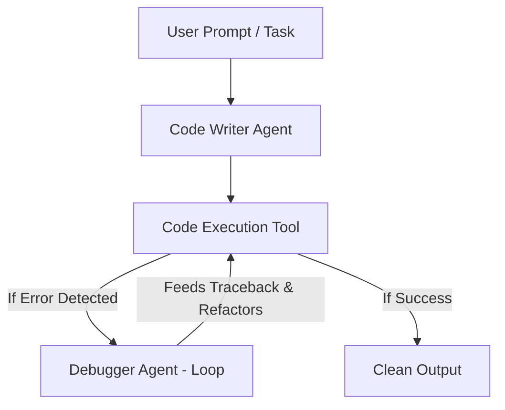

# Auto Code Fixer - Self-Healing Agentic Loop 🚀

An autonomous AI agent setup built with CrewAI and Gemini that moves beyond simple prompting to implement **Loop Engineering**.

## 🌟 Key Features
- **Coder Agent:** Writes Python code based on task requirements.
- **Python Execution Tool:** Executes code in a runtime environment to validate output.
- **Self-Healing Debugger Agent (Loop):** Captures error traces and automatically refactors code until execution succeeds.

## 🛠️ Tech Stack
- **Framework:** CrewAI
- **Language:** Python
- **Model:** Gemini AI
- ## 🚀 Quick Start 

1. **Clone the Repository:**
   ```bash
   git clone https://github.com/satyanarayana51115/auto-code-fixer.git
   cd auto-code-fixer
   ```
2. **Create a Virtual Environment:**
   ```
   python -m venv venv
   ```
3. **On Windows:**
   ```
   venv\Scripts\activate
   ```
4. **On Mac/Linux:**
   ```
   source venv/bin/activate
   ```
5. **Install Dependencies:**
   ```
   pip install -r requirements.txt
   ```
6. **Configure API Keys:**
   ```
   GEMINI_API_KEY=your_gemini_api_key_here
   ```
7. **Run the Self-Healing Loop:**
   ```
   python main.py
   ```

   ## 🔁 How the Self-Healing Loop Works



## 👨‍💻 Author
**Raj (Satyanarayana)** - [@satyanarayana51115] https://github.com/satyanarayana51115


 
 
 
  
  
   
